# 🎬 O+T 백오피스

 

<br/>

## 💎 프로젝트 개요

> **O+T**는 시청 데이터 기반 개인화 추천부터 추천 근거 제시까지 책임지는 새로운 OTT 플랫폼입니다.

| 항목           | 내용                                       |
| :------------- | :----------------------------------------- |
| **프로젝트명** | **O+T** (Open The Taste)                   |
| **주제**       | 데이터 분석 기반 맞춤형 콘텐츠 추천 서비스 |
| **타겟층**     | 콘텐츠 선택 장애를 겪는 모든 OTT 사용자    |
| **개발 기간**  | 2025.02.04 ~ 2025.03.20 (약 6주)           |
| **팀 구성**    | 7명 (프론트엔드 3명, 백엔드 4명)           |

<br/>

## 🚀 주요 기능

### 1. 시리즈 관리

|                    시리즈 조회                     |                    시리즈 등록                     |
| :------------------------------------------------: | :------------------------------------------------: |
| 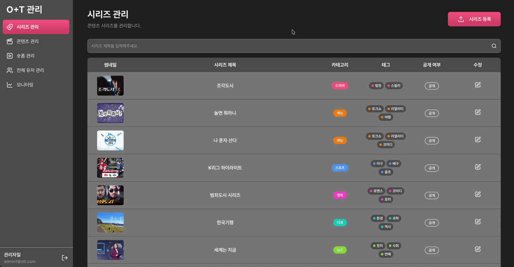 | 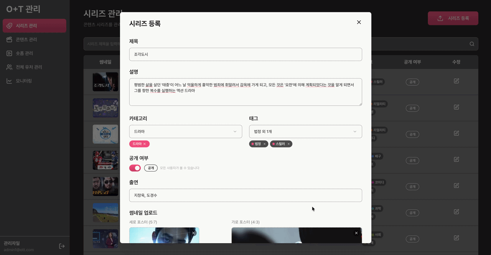 |

- 드라마, 영화, 예능 등 콘텐츠 시리즈 목록 관리 가능
- 시리즈 제목 검색을 통해 특정 시리즈를 바로 조회 가능
- “시리즈 등록” 버튼 클릭 시 시리즈 업로드 전용 모달이 열리고, 제목/설명/카테고리/태그/공개여부/출연진/썸네일 등을 입력하고 새 시리즈 업로드 가능
- 업로드 또는 시리즈 수정 모달에서 공개 여부 변경 가능

<br/>

### 2. 콘텐츠 관리

|                      콘텐츠 조회                       |                     콘텐츠 업로드                      |
| :----------------------------------------------------: | :----------------------------------------------------: |
| 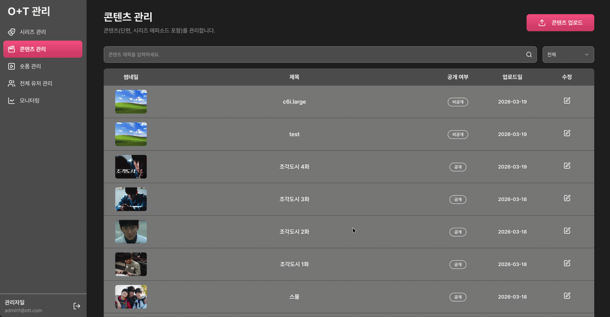 | 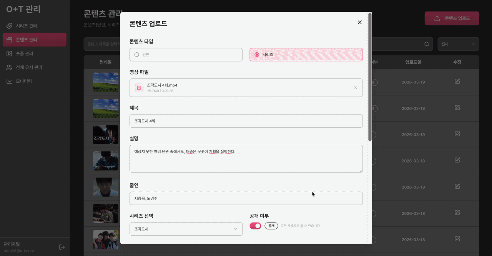 |

- 개별 영상 콘텐츠 목록 관리 가능
- 콘텐츠 업로드 버튼을 통해 새로운 단편 콘텐츠 업로드
- 검색 기능과 드롭다운 필터를 통해 특정 콘텐츠 조회 가능

<br/>

### 3. 숏폼 관리

|                        숏폼 조회                         |                       숏폼 업로드                        |
| :------------------------------------------------------: | :------------------------------------------------------: |
| 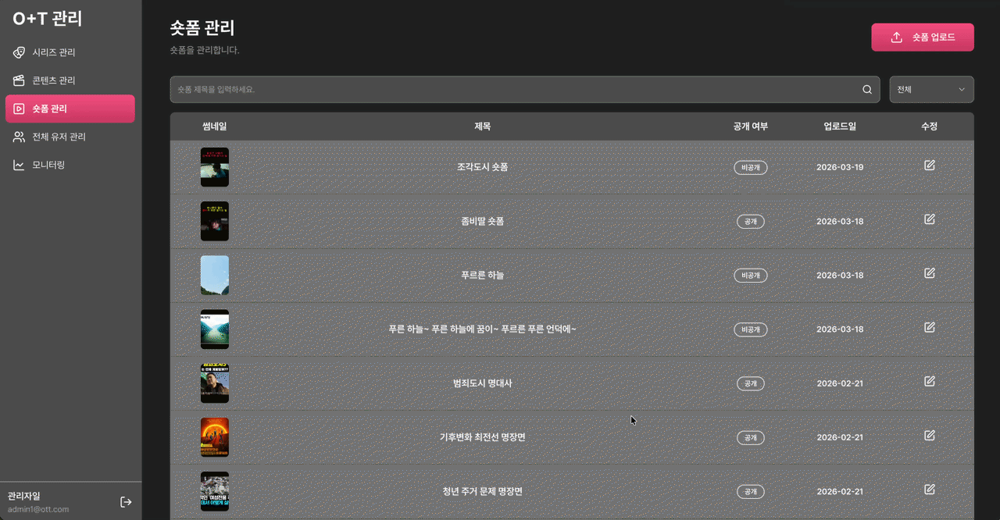 | 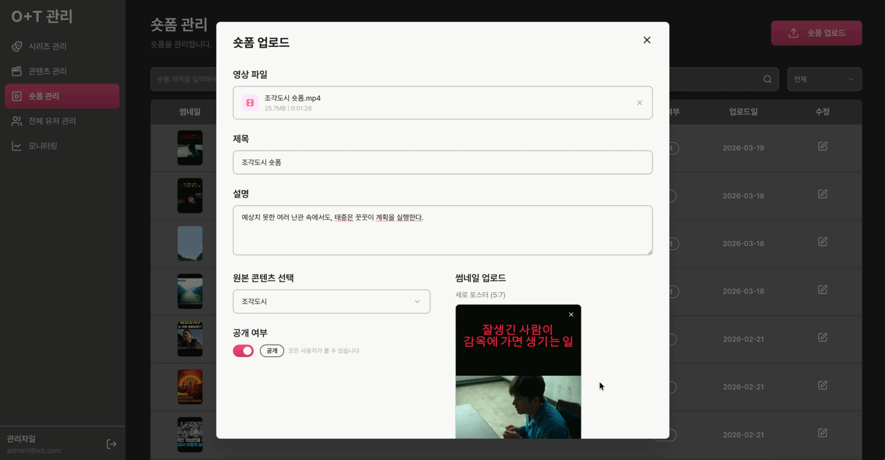 |

- 해당 탭의 리스트에서 각 숏폼의 썸네일, 제목, 공개 여부, 업로드 날짜 확인 가능
- **관리자**는 모든 사용자의 숏폼을, **에디터**는 본인이 올린 숏폼만 조회 가능
- 수정 아이콘 클릭 시 상세 정보 모달이 열림 (제목, 설명, 원본 콘텐츠, 공개 여부, 썸네일 확인 및 변경 가능)

<br/>

### 4. 전체 유저 관리

|          전체 유저 조회          |            에디터 ↔ 중지됨 전환            |
| :------------------------------: | :----------------------------------------: |
| 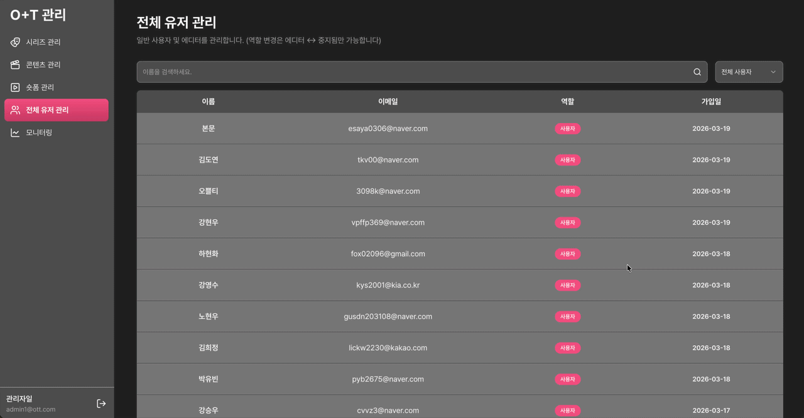 | 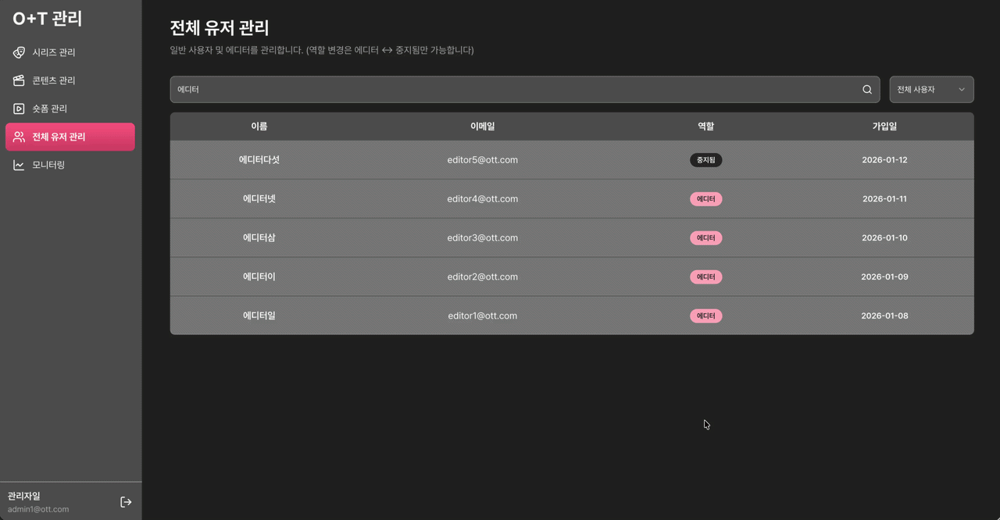 |

- 관리자 계정으로만 접속 가능한 전체 유저 관리 탭
- 에디터 또는 중지됨 역할 배지 클릭 시, 해당 사용자의 역할을 변경할 수 있는 모달이 열리고 해당 유저의 역할 수정 가능

<br/>

### 5. 모니터링 기능

|                   모니터링                   |                  대시보드                  |
| :------------------------------------------: | :----------------------------------------: |
| 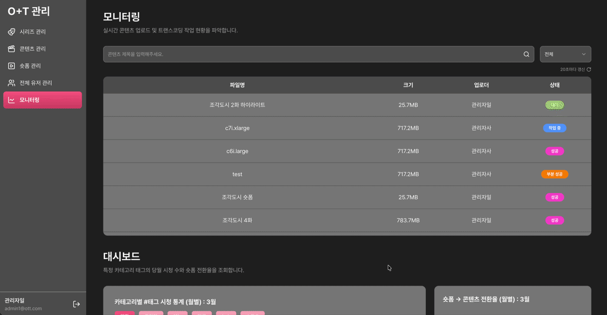 | 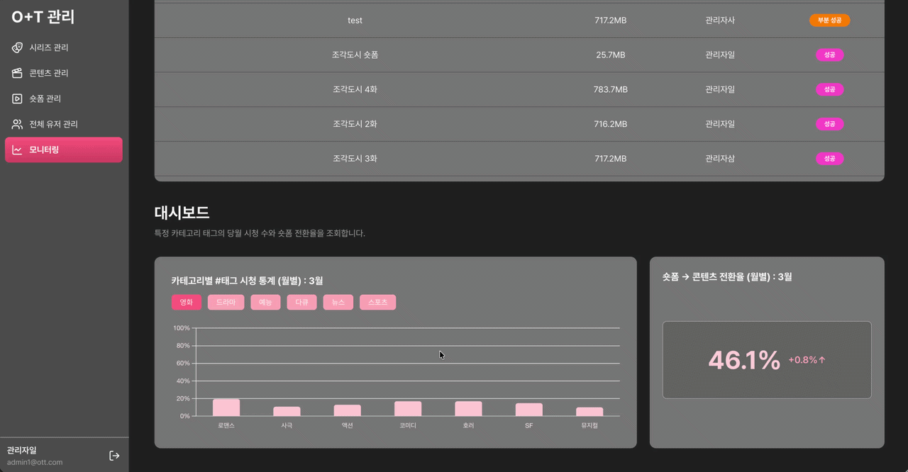 |

- 상태는 총 5단계로 분류하며 진행률에 따라 변경 (**에디터**는 본인이 올린 숏폼 모니터링만 조회 가능)
  - `PENDING`: 업로드 대기
  - `PROCESSING`: 업로드 진행중
  - `PARTIAL_SUCCESS`: 부분 완료 상태
  - `SUCCESS`: 업로드 완료
  - `FAILED`: 업로드 실패
- **카테고리별 태그 시청 통계 그래프**
  - 당월의 카테고리별 태그 시청 횟수를 그래프로 비교 가능
- **숏폼 → 콘텐츠 전환율**
  - 숏폼 페이지에 있는 해당 원본 콘텐츠로 이동하는 링크를 사용자들이 얼마나 클릭하였는지 전환율을 계산하여 표기
  - 당월의 전환율을 표기하며, 전월과 비교하여 증감 정도 표시

<br/>
                                                                                                            
## 🛠️ 기술 스택

| 분야              | 기술 스택                                                                                                                                                                                                                                                                                                                                                                                                        |
| ----------------- | ---------------------------------------------------------------------------------------------------------------------------------------------------------------------------------------------------------------------------------------------------------------------------------------------------------------------------------------------------------------------------------------------------------------- |
| **Frontend**      |     |
| **상태 관리**     |                                                                                                                                                                                                   |
| **API 통신**      |                                                                                                                                                                                                                                                                                                                                                    |
| **데이터 시각화** |                                                                                                                                                                                                                                          |
| **코드 품질**     |                                                                                                                                                      |
| **UI / 유틸리티** |                                                                                                                                                                                                                                                                                                                                            |

<br/>

## 📦 폴더 구조

```
src/
├── app/          # 라우트 진입점 (Next.js App Router)
├── layouts/      # 페이지 공통 골격
├── features/     # 기획 단위 기능
├── entities/     # 도메인 개념 단위
└── shared/       # 레포 내부 공통 인프라
```

<br/>

## 💡 S3 멀티파트 업로드 로직

| 업로드 구조                                                       | 설명                                                                                                                                                                                                                                                                                                                                                                                                                                                                                                                                                   |
| ----------------------------------------------------------------- | ------------------------------------------------------------------------------------------------------------------------------------------------------------------------------------------------------------------------------------------------------------------------------------------------------------------------------------------------------------------------------------------------------------------------------------------------------------------------------------------------------------------------------------------------------ |
| 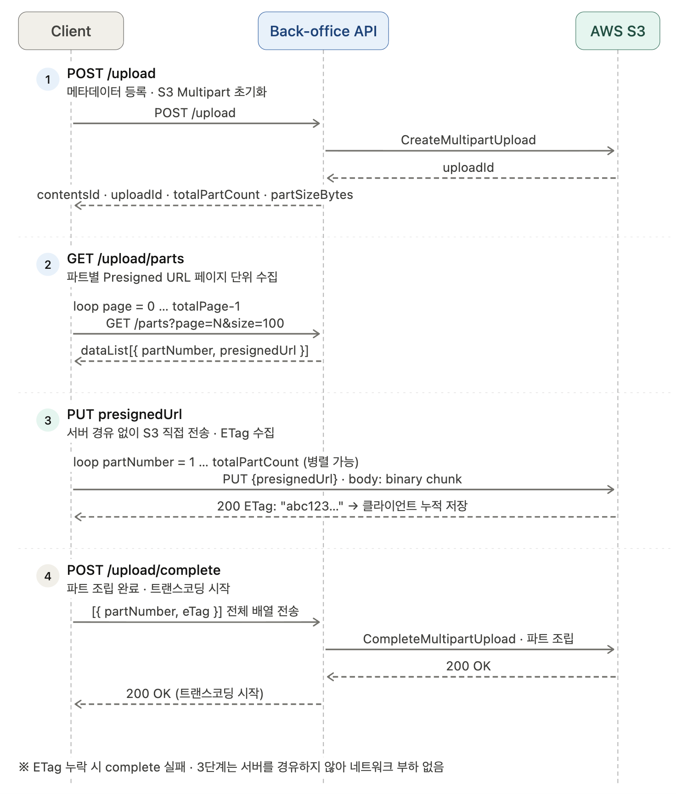 | **1. `POST /upload`**<br>메타데이터를 등록하고, 서버가 S3 Multipart 업로드를 초기화합니다.<br><br>**2. `GET /upload/parts`**<br>파트별 Presigned URL을 페이지 단위로 조회합니다.<br><br>**3. `PUT presignedUrl`**<br>클라이언트가 서버를 거치지 않고 S3에 각 파트를 직접 업로드합니다. 업로드가 끝나면 S3가 반환한 `ETag`를 `partNumber`와 함께 저장합니다.<br><br>**4. `POST /upload/complete`**<br>전체 `[{ partNumber, eTag }]` 배열을 서버로 보내면, 서버가 `CompleteMultipartUpload`를 호출해 분할 업로드된 파트를 하나의 원본 파일로 병합합니다. |

<br/>

## 🖥️ 로컬 개발 환경

1. **의존성 설치**
   ```bash
   npm install
   ```
2. **환경변수 설정**
   - `.env` 파일에 API 서버 주소 등 입력

3. **개발 서버 실행**
   ```bash
   npm run dev
   ```

<br/>

## 📌 WE ARE TEAM OF O+T

|                  이름                   | 역할                     |
| :-------------------------------------: | :----------------------- |
| [강현우](https://github.com/hyunw-kang) | TL, FE, Design           |
|   [김주희](https://github.com/joooii)   | Front Leader, FE, Design |
| [유재휘](https://github.com/RyuJaeHwi)  | FE, Design               |
